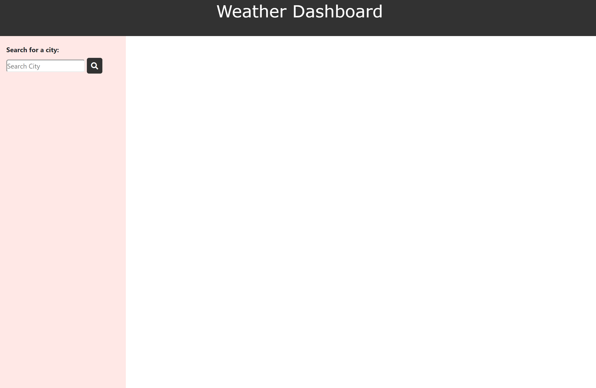
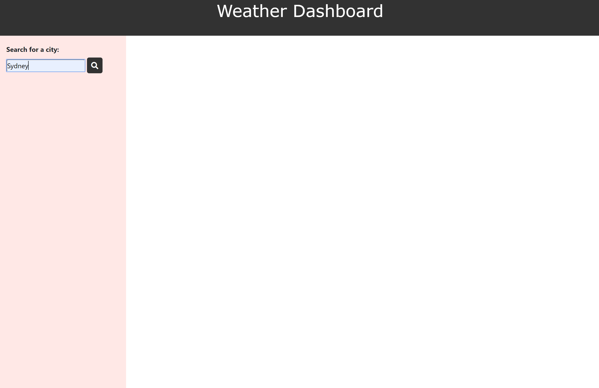
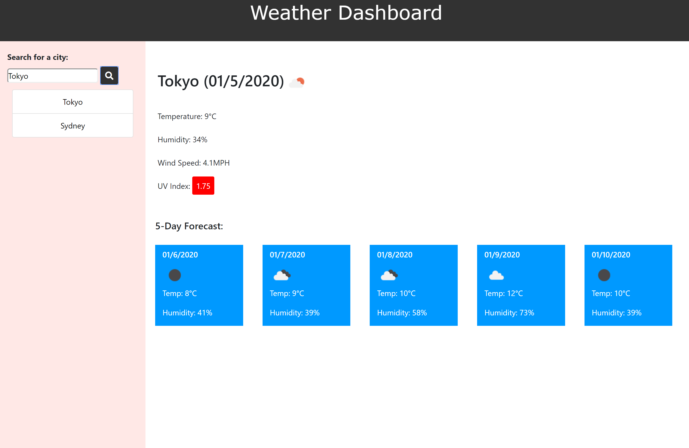
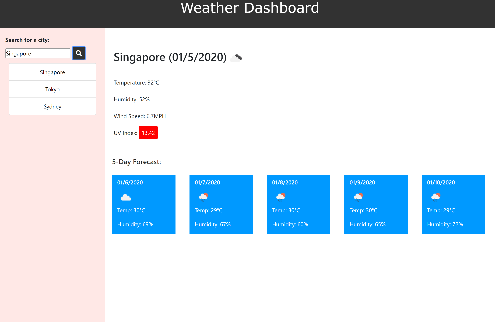
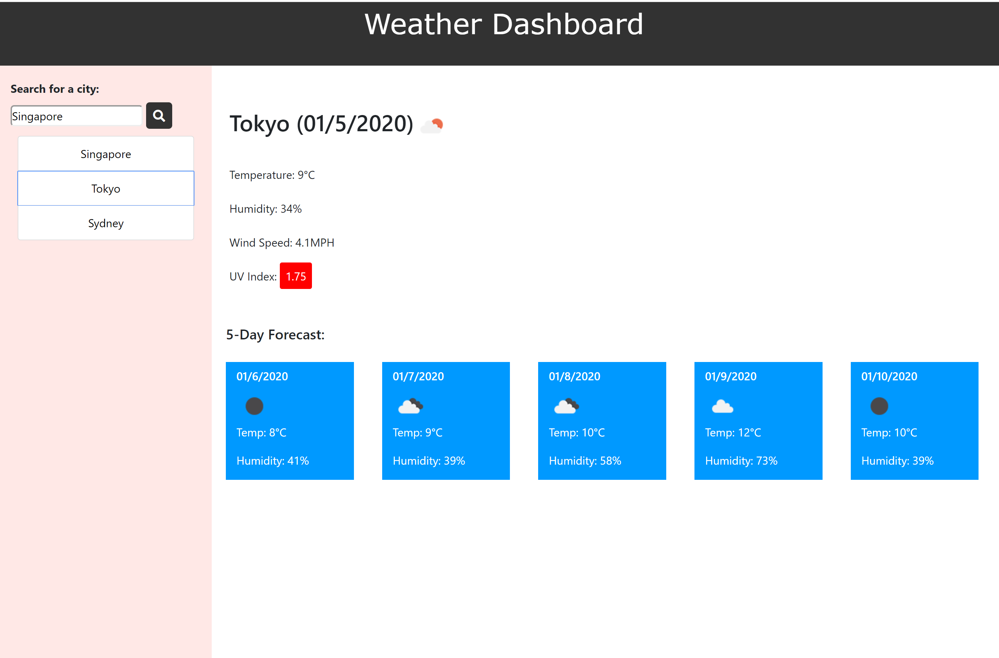

Open Weather API 

## Description 

The Open Weather API homework is to provide current and updated weather conditions to users based on the cities they search for. It provides at a glance the city name, date, temperature, humidity and the UV index. It also provides forecast for the next 5 days which will come in useful if they need to know the weather conditions for travel planning etc. 

It also appends the list of recent cities searched, so that user can simply click on it to retrieve data instead of having to re-type to search.

## Applications / Technology Used
+ HTML
+ CSS
+ jQuery
+ API / AJAX 
+ Openweathermap

## Usage 

1. Open webpage.

2. Type in city name and click on the search button to search for current weather condition.

3. Current weather condition and 5-day forecast will appear for the city searched.

4. Cities searched will be appended as a list of buttons on the sidebar for easy click later.

5. Search for a few more cities and try clicking on the recent cities searched.

## Credits

Sandesh has been helpful in guiding me when I'm lost. 

